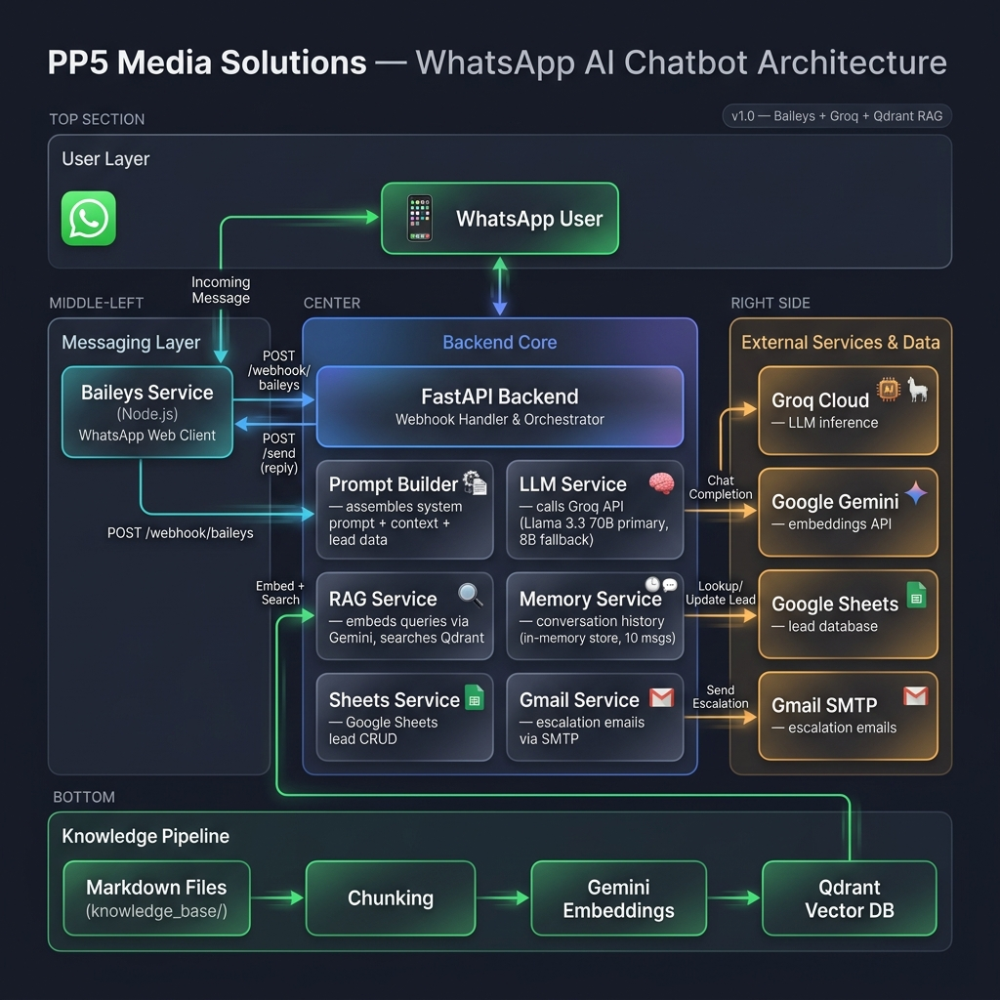

# PP5 WhatsApp AI Lead Generation & FAQ Chatbot

A production-ready WhatsApp chatbot for **PP5 Media Solutions** that answers company questions using RAG (Retrieval-Augmented Generation), qualifies leads naturally through conversation, and escalates financial queries to the team.

## Architecture



## Features

- **RAG-powered FAQ** — Answers company questions from the knowledge base only (no hallucination)
- **Natural lead qualification** — Gathers business info through conversation, one question at a time
- **Lead memory** — Remembers returning users via Google Sheets (phone number as key)
- **Lead scoring** — Automatic 0-100 scoring based on 7 qualification factors
- **Financial escalation** — Detects pricing/contract discussions and emails the team
- **Structured output** — LLM returns validated JSON for reliable data extraction

## Tech Stack

| Component | Technology | Cost |
|-----------|-----------|------|
| LLM | Groq (Llama 3.1 8B / 3.3 70B) | Free |
| Embeddings | Google Gemini (text-embedding-004) | Free |
| Vector DB | Qdrant (Docker) | Free |
| Messaging | Baileys (WhatsApp Web Library) | Free |
| Lead Storage | Google Sheets | Free |
| Escalation | Gmail SMTP | Free |
| Backend | Python FastAPI (Docker) | Free |

---

## Prerequisites

1. **Docker & Docker Compose** — [Install Docker Desktop](https://docs.docker.com/get-docker/)
2. **Groq API Key** (free) — [console.groq.com](https://console.groq.com)
3. **Google Gemini API Key** (free) — [aistudio.google.com/apikey](https://aistudio.google.com/apikey)
4. **Google Cloud Service Account** — For Sheets API access (see [Google Sheet Setup Guide](docs/google_sheet_setup.md))
5. **Gmail App Password** — [myaccount.google.com/apppasswords](https://myaccount.google.com/apppasswords)

---

## Quick Start

### Step 1: Clone & Configure

```bash
# Clone the repository
git clone <your-repo-url>
cd "WhatsApp Chatbot"

# Create your environment file
cp config/.env.example config/.env
```

Edit `config/.env` and fill in your API keys:
- `GROQ_API_KEY` — from Groq console
- `GEMINI_API_KEY` — from Google AI Studio
- `GOOGLE_SHEET_ID` — from your Google Sheet URL
- `GMAIL_SENDER` and `GMAIL_APP_PASSWORD` — your Gmail credentials
- `ESCALATION_RECIPIENT` — email address for escalation notifications

### Step 2: Set Up Google Sheets

Follow the detailed guide: [docs/google_sheet_setup.md](docs/google_sheet_setup.md)

Quick version:
1. Create a new Google Sheet
2. Add these headers in Row 1:
   ```
   Phone | Name | Business | Industry | Requirement | Monthly Leads | Company Size | Budget | Timeline | Decision Maker | Lead Score | Lead Status | Conversation Stage | Missing Information | Summary | Escalated | Last Updated
   ```
3. Create a Google Cloud Service Account and share the sheet with it
4. Download the JSON key and place it at `config/service_account.json`

### Step 3: Start Docker Services

```bash
# Start Qdrant
docker compose -f docker/docker-compose.yml up -d qdrant

# Run Backend
python -m backend.main

# Run Baileys
cd baileys
npm install
node index.js
```
*(On first run of Baileys, scan the QR code printed in the terminal with your WhatsApp app).*

### Step 4: Run Knowledge Base Ingestion

```bash
# This reads the knowledge base files, generates embeddings, and stores vectors in Qdrant
docker compose -f docker/docker-compose.yml --profile ingestion run --rm ingestion
```

You should see output confirming chunks were created and uploaded to Qdrant.

### Step 5: Test!

Send a WhatsApp message to the phone number you linked with Baileys. The chatbot should respond!

---

## Updating the Knowledge Base

1. Edit or add `.md` files in the `knowledge_base/` directory
2. Re-run the ingestion pipeline:
   ```bash
   docker compose -f docker/docker-compose.yml --profile ingestion run --rm ingestion
   ```
3. The old vectors are replaced with the updated ones

---

## Production Deployment

For deploying to a cloud server:

1. **Provision a VM** — DigitalOcean Droplet, AWS EC2, or a GPU VPS.
2. **Install Docker and Node.js** on the VM
3. **Upload project files** via Git or SCP
4. **Configure `.env`** with production values
5. **Start services** (Qdrant, Backend, Baileys).
6. **Run ingestion pipeline**.

---

## Troubleshooting

| Issue | Solution |
|-------|----------|
| Backend won't start | Check `config/.env` exists and has valid API keys |
| Qdrant connection error | Ensure Qdrant container is running |
| No response from bot | Check backend and baileys logs |
| "I don't have information" | Run ingestion to populate Qdrant with knowledge base |
| Google Sheets error | Verify service account JSON path and sheet sharing |
| Baileys disconnected | Delete `baileys/auth_info` folder and rescan the QR code |
| Gmail not sending | Verify App Password is correct (not regular password) |

---

## Project Structure

```
WhatsApp Chatbot/
├── knowledge_base/          # Company documents for RAG
├── ingestion/               # Pipeline: chunk → embed → upload to Qdrant
├── backend/                 # FastAPI app with all business logic
│   └── services/            # Modular services (Baileys, Sheets, RAG, LLM, Gmail)
├── prompts/                 # System prompt and scoring rubric
├── baileys/                 # WhatsApp Web Node.js client
├── config/                  # Environment variables and credentials
├── docker/                  # Dockerfiles and docker-compose
└── docs/                    # Setup guides and test conversations
```

---

## License

Proprietary — PP5 Media Solutions
